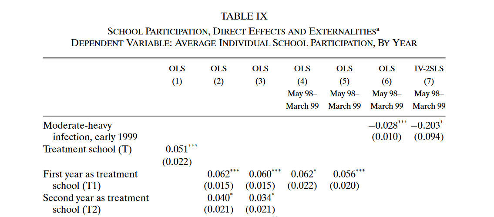

Introduction to Applied Statistics in R
========================================================
author: Frederic Denker
date: 29.08.2020
autosize: true


We want to be able to answer the big questions of society
========================================================


 - For this we need to answer many "small questions"
 - Rigorous statistical analysis is the tool we need for this
 
 
 
 (Source: Miguel, Edward, and Michael Kremer. 2004. "Worms: Identifying Impacts on Education and Health in the Presence of Treatment Externalities." Econometrica 72 (1): 159-217.)
What does this picture mean?
========================================================

 - This is the regression output from a paper by Nobel Laureate Michael Kremer and Edward Miguel
 - With this they was able to show the economic relevance of a specific medical treatment
 - This paper more or less resulted in more than 100 million children treated every year
 


Intro to R
========================================================

"R is a statistical programming language that is free to use" 
 - **Programming** -> We are going to be working with code
 - **Language** -> We will teach you the vocabulary / syntax you need
 
 - .. to solve practical question through **statistics**


How R works
========================================================
 
 
 - R works as a calculator
 - Everything in R is a relation of objects and functions
  - objects store information for us which can be single variable or whole datasets
  - functions are actions that we would like to happen to our objects

How can you effectively use R?
========================================================

- First you need to o to https://cran.r-project.org/ and download & execute the version that is right for your OS
- However, we do not want to just run R, but have a nice interface to programming easier and more convenient:
- There are many interfaces for using it, the most popular one is RStudio
- Go to https://rstudio.com/products/rstudio/download/#download to download and install RStudio for your operating system
- After installing run RStudio (R will be started automatically)


Using RStudio
========================================================
- The main panels in RStudio are
  - **Console**
      - This firstly tells us which version of R we are running on
      - You can directly execute code from here, e.g:
      - ```120 + 5```
      - `print("Hello World!")`
  - **Environment**
      - This is where objects are stored, e.g:
      - If you define  ` hype_level <- 120 + 5` the object `hype_level` will be in your environment

Using RStudio 
=======================================================
 - The next panels in RStudio are:
  - **Help**
     - This is where documentation from packages and functions is displayed
     - If we want to know more about a function just write in the console `?print` or `??print`
  - **Source**
     - This is basically a plain-text editor
     - We record what we do in scripts which are displayed here

Before we jump into programming
=======================================================
 Let us set up the project:
 - This keeps our programming clean and folder structure understandable
 - Within the project we create have a data, a script and an output folder

If you want to know more:
=======================================================

 - [swirl](https://swirlstats.com/students.html) is a package to learn R in R
 - [This blog post](https://www.r-bloggers.com/tutorial-getting-started-with-r-and-rstudio/) might be useful as a resource to give a more detailed introduction to R and RStudio.
 - [This](https://stat545.com/) is a very popular course to learn R and statistics.
 - [This textbook](https://learningstatisticswithr.com/lsr-0.6.pdf) is a good resource as an intro to R and statistics
