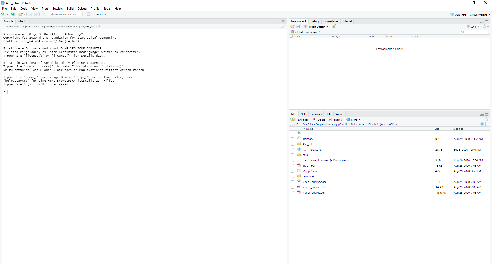

Introduction to Applied Statistics in R
========================================================
author: Frederic Denker
date: 29.08.2020
autosize: true

<style>
.small-code pre code {
  font-size: 1em;
}
</style>

<style>
.reveal .slides section .slideContent ul li{
    font-size: 18pt;
}
</style>

<style>
.reveal .slides{
    width: 70% !important;  /* or other width */
}
</style>

We want to be able to answer the big questions of society
========================================================


 - For this we need to answer many "small questions"
 - Rigorous statistical analysis is the tool we need for this
 
 
 
 (Source: Miguel, Edward, and Michael Kremer. 2004. "Worms: Identifying Impacts on Education and Health in the Presence of Treatment Externalities." Econometrica 72 (1): 159-217.)
 
What does this picture mean?
========================================================

 - This is the regression output from a paper by Nobel Laureate Michael Kremer and Edward Miguel
 - With this they were able to show the economic relevance of a specific medical treatment
 - This paper more or less resulted in more than 100 million children treated every year
 


Intro to R
========================================================

"R is a statistical programming language that is free to use" 
 - **Programming** -> We are going to be working with code
 - **Language** -> We will teach you the vocabulary / syntax you need
 
 - ...to solve practical question through **statistics**


How R works
========================================================
 
 
 - R works as a calculator
 - Everything in R is a relation of **objects** and **functions**
  - objects store information for us which can be single variable, whole datasets among many other
  - functions are actions that we would like to apply to objects

How can you effectively use R?
========================================================

- First you need to go to https://cran.r-project.org/ and download & execute the version that is right for your OS
- For the course you should have R version 4.0.2 (the last released version)
- However, we do not want to just run R, but have a nice interface to programming easier and more convenient:
- There are many interfaces for using it, the most popular one is RStudio
- Go to https://rstudio.com/products/rstudio/download/#download to download and install RStudio for your operating system
- After installing run RStudio (R will be started automatically)


Using RStudio
========================================================
- The main panels in RStudio are
  - **Console**
  - **Environment**
  - **Help**
  - **Scripts**
  
Using RStudio
========================================================




Console
========================================================
- This firstly tells us which version of R we are running on
- You can directly execute code from here, e.g:


```r
120 + 5
```

```
[1] 125
```

```r
print("Hello World!")
```

```
[1] "Hello World!"
```

Environment
========================================================
- This is where objects are stored, e.g:


```r
hype_level <- 120 + 5
hype_level # it's not necessary to use print
```

```
[1] 125
```


Help & Scripts
=======================================================
- **Help**
   - This is where documentation from packages and functions is displayed
   - If we want to know more about a function just write in the console `?print` or `??print`
- **Scripts**
   - This is created when we 
   - This is basically a plain-text editor
   - We record what we do in scripts which are displayed here

Before we jump into programming
=======================================================
 Let us set up the project:
 - This keeps our programming clean and folder structure understandable
 - Within the project we create have a data, a script and an output folder

Packages & libraries in R
=======================================================

 - There are situations in which "base R" (so just the programming language itself) does not have all the functions we desire.
 - For these cases we use *packages* that are created by the community and extend the R functionality
 - We install these packages from the central CRAN directory which hosts most of the packages as follows
   - `install.packages("package_name")` 
 - Similar to programs you have installed, we need to start it every time we wish to use it
  - The command for this is `library(package_name)` 
 
 
If you want to know more
=======================================================

These are some of the resource we used:
 - [swirl](https://swirlstats.com/students.html) is a package to learn R within R
 - [This blog post](https://www.r-bloggers.com/tutorial-getting-started-with-r-and-rstudio/) might be useful as a resource to give a more detailed introduction to R and RStudio.
 - [This](https://stat545.com/) is a very popular course to learn R and statistics.
 - [This textbook](https://learningstatisticswithr.com/lsr-0.6.pdf) is a good resource as an intro to R and statistics
 - [This website](https://style.tidyverse.org/index.html) with additional information on how to style your code
 - There are many others! Feel free to look for resources that fit your learning strategy
