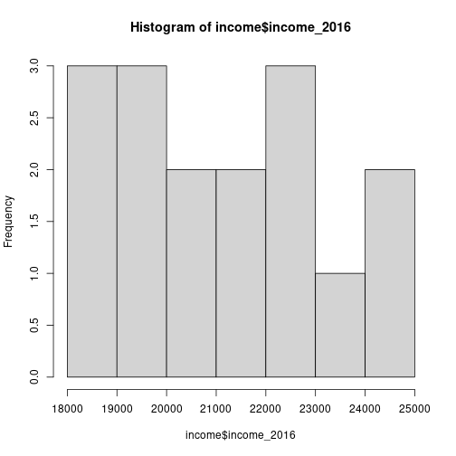
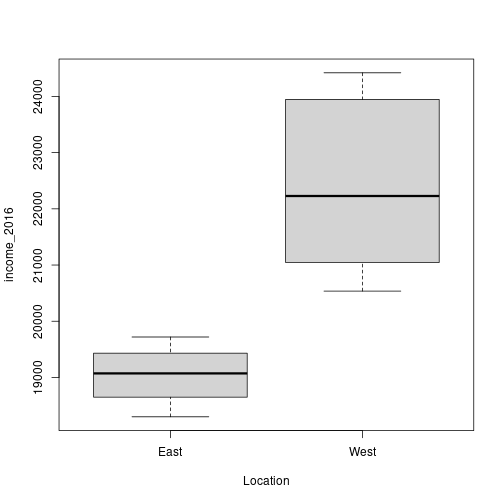

Introduction to coding with R 
========================================================
author: Frederic Denker
date: 25.08.2020
autosize: true


The general data pipeline
=======================================================


We will follow these steps in this tutorial and in this course.

Preparing to load in data
========================================================

- Get your data to the right working directory (to the data folder we created earlier)
- Now we load in the data
- However, R does not natively support Stata files so we use a package to help us 
- To install **sjlabelled** use the `install.packages("sjlabelled")` command
- Now the package is installed but we need to load it into R
  - This of this like starting the a programm you just installed
  - the command for this is `library("sjlabelled")`

Actually loading in data
========================================================

```r
library("sjlabelled")
income=read_stata(path="data/haushaltseinkommen.dta")
```
A bit of explanation before we do more with the data:
 
We used a function `read_stata()` from the package to do something for us (in this case importing the data).
However, the function needs to know what file it should read. 

Therefore, we pass an argument `(path="data/haushaltseinkommen.dta")` to the function which specifies the path.

Because we do not want to just display the data from the file but save it to the variable `income`. 


Introduction to the different types of data types
========================================================

- Main data types or modes
  - logical: `TRUE`, `FALSE`
  - numeric: `1`, `3.14`
  - integer: `2L` (the `L` makes R store the number as integer)
    - special type of numeric
  - character: `"a"`, `"foo"`, `"foo bar"`

Introduction to the different types of data types
========================================================

To find out which type a variable is we can use:

```r
class(TRUE)
```

```
[1] "logical"
```

```r
class(1.3)
```

```
[1] "numeric"
```

```r
class(1L)
```

```
[1] "integer"
```

```r
class("this should be a character")
```

```
[1] "character"
```

This is also well explained [here](https://www.youtube.com/watch?v=hxlHQ2AtLUk).


Introduction to the different types of data structures
========================================================

- Main data structures
  - Vector
  - Data Frame
  - List
  - Matrix
  - Factor

Introduction to the different types of data structures
========================================================

- Most important data structures
  - **Vector**
  - **Data Frame**
  - **Factor**
  - List
  - Matrix


More detail on data structures with a lot of examples can be found [here.](https://intellipaat.com/blog/tutorial/r-programming/data-structures-r-programming/)


Explaining Vectors
========================================================

Vectors are homogeneous in nature, which means that it only contains elements of the same data type.

```r
# I can write comments with the # symbol
# This should be used to explain code
# The c() function creates vectors  
Vec_numeric <- c(44, 25, 64, 96, 30)
Vec_numeric
```

```
[1] 44 25 64 96 30
```

```r
vec_char <- c("We","can", "also","do","this")
vec_char
```

```
[1] "We"   "can"  "also" "do"   "this"
```

```r
typeof(vec_char)
```

```
[1] "character"
```
We will see how to use these Vectors later in this tutorial.

Explaining Data Frames
========================================================

A data frame in R programming is a 2-dimensional array-like structure that also resembles a table, in which each column contains values of one variable and each row contains one set of values from each column. You can think of it like a excel table. 

```r
states = c("Bayern","Berlin","Sachsen")
average_income = c(25000,19000,20000)
df = data.frame(states,average_income)
df
```

```
   states average_income
1  Bayern          25000
2  Berlin          19000
3 Sachsen          20000
```
The data stored in Data Frames can have numeric, factor and character types.

Some thoughts for Data Frames
========================================================

[This is a very good writeup](https://cran.r-project.org/web/packages/tidyr/vignettes/tidy-data.html) about Data Frame and how they should be formatted.

The general idea is that the state that datasets should achieve is tidy data. In tidy data:


1. Each variable forms a column.

2. Each observation forms a row.

3. Each type of observational unit forms a table.

This makes the data much more accessible for later data analyses.

Factors
========================================================
Used in statistical modeling. They categorize unique values in columns and store them as levels. This is especially usefull if there are only a limited number of unique values. 


```r
data <- c("Male","Female","Male","Male","Female","Female")
factor_data <- factor(data)

factor_data
```

```
[1] Male   Female Male   Male   Female Female
Levels: Female Male
```
While we are at it, we should also factor our imported dataset

```r
income$Location = factor(income$Location)
```


The other data types 
========================================================

Lists:
 - R objects which can store numbers, character, vectors, another list or matrix inside of it.
 
Matrices:
 - R object similar to Data Frames only that they can only store one type of data

 

Exploring the data
========================================================

- How can we look at the data
  - `head()`
  - `names()`
  - `view()`
  - `summary()`
  - `table()`


names()
========================================================

```r
names(income)
```

```
[1] "State"       "income_2016" "Location"   
```

Head()
========================================================
This returns us the first 5 rows from the object.

```r
head(income)
```

```
               State income_2016 Location
1            Hamburg       24421     West
2             Bayern       24026     West
3  Baden-Württemberg       23947     West
4             Hessen       22454     West
5    Rheinland-Pfalz       22240     West
6 Schleswig-Holstein       22217     West
```

View()
========================================================
The function opens up a new tab in the editor which allows you to view the data similarly to a read-only excel.

```r
View(income)
# However, when viewing a Data Frame be mindful that it might load a lot data, which can be resource intensive.
# Therefore you can also combine head() and View()

View(head(income))
```

summary()
========================================================
The function opens up a new tab in the editor which allows you to view the data similarly to a read-only excel.

```r
summary(income)
```

```
    State            income_2016    Location 
 Length:16          Min.   :18299   East: 6  
 Class :character   1st Qu.:19371   West:10  
 Mode  :character   Median :20885            
                    Mean   :21091            
                    3rd Qu.:22294            
                    Max.   :24421            
```

table()
========================================================
The function returns a frequency table. 

```r
table(income$Location)
```

```

East West 
   6   10 
```
FYI: you can also create a frequency table on two different variables.

Let us now work with data
========================================================

After getting an overview over the data, we may now want to be able to filter the data and look at specific rows & columns

Data subsetting in base R #1
========================================================


```r
# This returns all the values from the State column
income$State
```

```
 [1] "Hamburg"                "Bayern"                 "Baden-Württemberg"     
 [4] "Hessen"                 "Rheinland-Pfalz"        "Schleswig-Holstein"    
 [7] "Nordrhein-Westfalen"    "Niedersachsen"          "Bremen"                
[10] "Saarland"               "Berlin"                 "Brandenburg"           
[13] "Sachsen"                "Thüringen"              "Sachsen-Anhalt"        
[16] "Mecklenburg-Vorpommern"
attr(,"format.stata")
[1] "%-9s"
```

```r
# We can select specific rows and columns by using the squared brackets
# dataframe[row,colum]
income[1,1] # Select the first column and first row
```

```
[1] "Hamburg"
```

Data subsetting in base R #2
========================================================


```r
# We can select specific rows and columns by using the squared brackets
income[1,1:2] # Select the first row and the first to the second column
```

```
    State income_2016
1 Hamburg       24421
```

```r
# As information this returns: 
1:4
```

```
[1] 1 2 3 4
```

```r
# We can build on that:
# If we only want to specify either rows or columns we can leave the other side blank
income[1:4,]
```

```
              State income_2016 Location
1           Hamburg       24421     West
2            Bayern       24026     West
3 Baden-Württemberg       23947     West
4            Hessen       22454     West
```


Data subsetting in base R #3
========================================================


```r
# We can pass it a vector such as # c(1,4,5)
income[c(1,4,5),]
```

```
            State income_2016 Location
1         Hamburg       24421     West
4          Hessen       22454     West
5 Rheinland-Pfalz       22240     West
```

```r
# We can also select through named vectors
income[1:3,c("State","income_2016")]
```

```
              State income_2016
1           Hamburg       24421
2            Bayern       24026
3 Baden-Württemberg       23947
```

Data subsetting in base R #4
========================================================


```r
# We can also do conditional subsetting
# If we want filter the table to only display all the states over 22400 income
income[income$income_2016 >22400, ]
```

```
              State income_2016 Location
1           Hamburg       24421     West
2            Bayern       24026     West
3 Baden-Württemberg       23947     West
4            Hessen       22454     West
```

```r
# We can then specify that we only want the state names
income[income$income_2016 >22400, "State"]
```

```
[1] "Hamburg"           "Bayern"            "Baden-Württemberg"
[4] "Hessen"           
```


TODO Data subsetting with the tidyverse 

Data plotting
========================================================


```r
hist(income$income_2016)
```



Data plotting
========================================================


```r
boxplot(income_2016~ Location, data= income)
```




Data plotting
========================================================

For plotting we use the `ggplot2` package

```r
library(ggplot2)
```

Should we include this?
